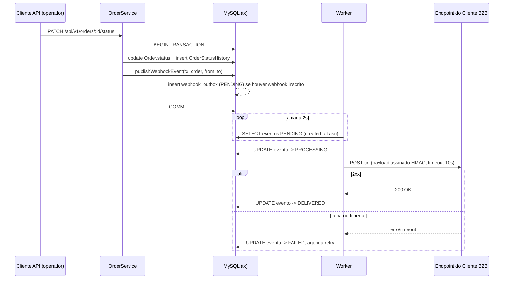
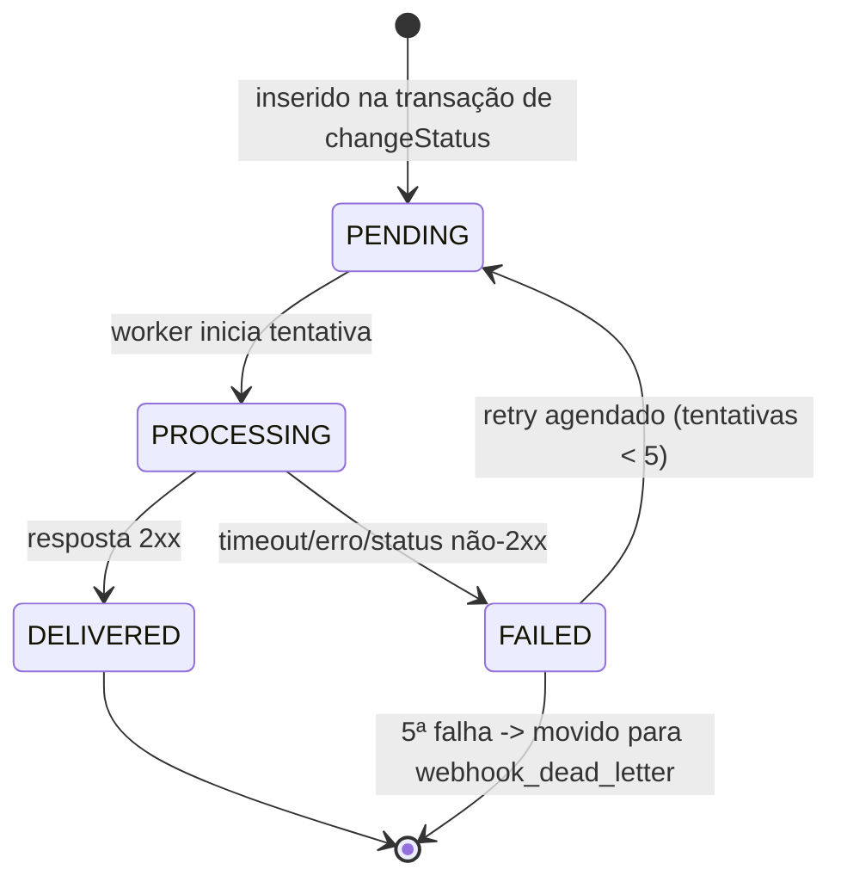

### FDD: Sistema de Webhooks de Notificação de Pedidos

Versão: 1.0
Data: 2026-07-04
Responsável: Antonio Canhota

---

### 1. Contexto e motivação técnica

Três clientes B2B (Atlas Comercial, MaxDistribuição e Nova Cargo) pediram para ser notificados em até 10 segundos quando o status de um pedido muda, em vez de continuar fazendo polling manual em `GET /orders`, integração que hoje é lenta e cara para eles ([09:00]-[09:02] Marcos). O escopo é estritamente outbound: a plataforma envia, os clientes apenas recebem ([09:02]-[09:03] Sofia/Marcos).

O ponto técnico central é `OrderService.changeStatus` (`src/modules/orders/order.service.ts:126-179`), que já executa uma transação pesada — atualiza `Order.status`, insere `OrderStatusHistory`, debita/repõe `Product.stockQuantity` — e não pode ficar acoplada à disponibilidade de um sistema de terceiros: um cliente lento ou fora do ar travaria a mudança de status de outros pedidos, e não haveria como reverter uma chamada HTTP já enviada em caso de rollback ([09:04] Bruno). Essa restrição descartou disparo síncrono e motivou o padrão outbox transacional já fechado em [ADR-001](adrs/ADR-001-padrao-outbox-em-mysql-para-eventos-de-webhook.md): dentro da mesma transação SQL, um evento é inserido em `webhook_outbox`; um worker dedicado (processo separado, [ADR-003](adrs/ADR-003-worker-como-processo-separado.md)) consome essa tabela via polling de 2 segundos ([ADR-002](adrs/ADR-002-consumo-do-outbox-via-polling.md)) e entrega os eventos por HTTP, com retry, DLQ e assinatura HMAC.

Este FDD detalha o comportamento técnico verificável dessa entrega: fluxos, contratos públicos (CRUD de configuração, histórico de entregas, replay administrativo, e o próprio payload entregue ao cliente), matriz de erros, observabilidade e pontos de integração com o código existente. Não repete a deliberação de arquitetura já registrada no RFC e nas ADRs.

**Atores:**
- Clientes B2B (consumidores do webhook, donos do endpoint HTTPS que recebe os eventos)
- Operador/usuário autenticado via JWT que faz o CRUD de configuração de webhook em nome do customer ([09:31]-[09:33] Marcos/Bruno/Larissa — o JWT é do usuário operador, não do cliente B2B)
- Administrador (role `ADMIN`) que executa replay manual de eventos em DLQ ([09:36] Sofia/Larissa)
- Worker de processamento (ator de sistema, processo `src/worker.ts` separado da API)

**Limites de escopo:** ver seção 3.

---

### 2. Objetivos técnicos

- Notificar o cliente em até 10 segundos desde a mudança de status, com folga: o polling de 2s do worker garante latência mínima conhecida de até 2s no pior caso antes da primeira tentativa de entrega ([09:02] Marcos, [ADR-002](adrs/ADR-002-consumo-do-outbox-via-polling.md))
- Garantir atomicidade entre a mudança de status do pedido e o registro do evento correspondente: nunca existe uma sem a outra, commit e rollback sempre consistentes entre si ([ADR-001](adrs/ADR-001-padrao-outbox-em-mysql-para-eventos-de-webhook.md))
- Tolerar indisponibilidade temporária do endpoint do cliente por até ~15 horas via retry com backoff exponencial (5 tentativas: 1m/5m/30m/2h/12h) antes de mover para DLQ ([ADR-004](adrs/ADR-004-retry-com-backoff-exponencial.md))
- Limitar cada tentativa de entrega HTTP a um timeout de 10 segundos, tratando estouro de timeout como falha sujeita a retry ([09:42] Diego)
- Garantir autenticidade e integridade de todo payload entregue via HMAC-SHA256, com secret única por endpoint webhook e suporte a rotação com grace period de 24h ([ADR-006](adrs/ADR-006-autenticacao-hmac-sha256-com-rotacao-de-secret.md))
- Garantir entrega at-least-once, com `X-Event-Id` estável entre tentativas para permitir deduplicação do lado do cliente ([ADR-007](adrs/ADR-007-entrega-at-least-once-com-dedup-por-event-id.md))
- Preservar ordem de entrega por `order_id` enquanto o sistema operar em regime single-worker (limitação conhecida, não é garantia de ordering global) ([09:12]-[09:13] Diego)
- Nunca enviar payload de evento acima de 64KB; rejeitar cadastro de URL não-HTTPS ([09:23]-[09:24] Sofia/Diego/Larissa)

---

### 3. Escopo e exclusões

**Incluído**
- Tabela `webhook_outbox` com inserção transacional a partir de `OrderService.changeStatus`, via função `publishWebhookEvent(tx, order, fromStatus, toStatus)` ([09:41] Bruno/Diego, [ADR-001](adrs/ADR-001-padrao-outbox-em-mysql-para-eventos-de-webhook.md))
- Worker dedicado (`src/worker.ts`, script `npm run worker`) em polling de 2s ([ADR-002](adrs/ADR-002-consumo-do-outbox-via-polling.md), [ADR-003](adrs/ADR-003-worker-como-processo-separado.md))
- Retry com backoff exponencial (5 tentativas) e DLQ em `webhook_dead_letter` ([ADR-004](adrs/ADR-004-retry-com-backoff-exponencial.md), [ADR-005](adrs/ADR-005-dlq-em-tabela-separada-com-replay-administrativo.md))
- Endpoint administrativo de replay de DLQ, restrito a `ADMIN`, com log de auditoria ([09:18]-[09:19], [09:35]-[09:36])
- Autenticação HMAC-SHA256 por endpoint, com rotação de secret e grace period de 24h ([ADR-006](adrs/ADR-006-autenticacao-hmac-sha256-com-rotacao-de-secret.md))
- CRUD de configuração de webhook (cadastro, edição, remoção, listagem), com filtro de status desejados por endpoint ([09:31]-[09:34] Marcos/Bruno)
- Histórico de entregas por webhook, últimos 100 registros ([09:34] Marcos)
- Módulo `src/modules/webhooks` seguindo os padrões existentes do projeto ([ADR-008](adrs/ADR-008-modulo-de-webhooks-seguindo-padroes-existentes.md))

**Excluído**
- Notificação de falha persistente ao cliente por e-mail — fase futura ([09:37]-[09:38] Marcos/Larissa)
- Rate limiting de envio ao cliente — apenas observação futura, sem mitigação nesta fase ([09:38]-[09:39] Diego/Larissa)
- Dashboard visual para o cliente acompanhar webhooks — projeto separado do time de frontend ([09:39]-[09:40] Marcos/Larissa)
- Garantia de ordering global entre múltiplos workers (só vale em regime single-worker) ([09:12]-[09:13] Diego)
- Arquivamento/retenção de eventos entregues após ~30 dias ([09:08] Diego)
- Webhooks inbound (cliente → plataforma) ([09:02]-[09:03] Sofia/Marcos)
- Circuit breaker para chamadas HTTP de entrega — não discutido na reunião, ausente nesta fase

---

### 4. Fluxos detalhados e diagramas

**Fluxo principal (mudança de status → entrega do webhook)**
- Requisição autenticada chega em `PATCH /api/v1/orders/:id/status` (endpoint já existente, sem mudança de contrato)
- `OrderService.changeStatus` abre `$transaction`, valida a transição via `canTransition`, aplica débito/reposição de estoque, atualiza `Order.status`, insere `OrderStatusHistory` (fluxo já existente)
- Dentro da mesma transação, chama `publishWebhookEvent(tx, order, fromStatus, toStatus)` ([ADR-001](adrs/ADR-001-padrao-outbox-em-mysql-para-eventos-de-webhook.md))
- `publishWebhookEvent` busca os webhooks ativos do `customerId` do pedido cuja lista `events` inclui `toStatus`; se nenhum casar, não insere nada ([09:33]-[09:34] Marcos/Bruno/Diego)
- Para cada webhook casado, monta o payload já renderizado (snapshot no momento da inserção, não recalculado depois) e insere uma linha `PENDING` em `webhook_outbox`, com `event_id` (UUID) gerado nesse momento ([09:51]-[09:52] Larissa/Diego/Bruno)
- Transação commita: mudança de status e evento(s) de outbox ficam atômicos entre si
- Worker (`src/worker.ts`) faz polling a cada 2s, busca lote de eventos `PENDING` mais antigos por `created_at` ([ADR-002](adrs/ADR-002-consumo-do-outbox-via-polling.md))
- Para cada evento: marca como `PROCESSING`, calcula HMAC-SHA256 do corpo com a secret ativa do webhook, monta headers (`X-Event-Id`, `X-Signature`, `X-Timestamp`, `X-Webhook-Id`, `Content-Type`), envia `POST` para a `url` cadastrada com timeout de 10s ([09:42]-[09:44] Diego/Sofia)
- Resposta 2xx → marca evento `DELIVERED`, grava entrada no histórico de entregas
- Falha (timeout, erro de rede, status não-2xx) → marca `FAILED`, incrementa contador de tentativas, agenda próxima tentativa conforme backoff (1m/5m/30m/2h/12h) voltando o evento para `PENDING` com `next_attempt_at` no futuro ([ADR-004](adrs/ADR-004-retry-com-backoff-exponencial.md))
- Após a 5ª falha consecutiva → evento sai de `webhook_outbox` e é registrado em `webhook_dead_letter` (payload, motivo, timestamp), parando de ser retentado automaticamente ([ADR-005](adrs/ADR-005-dlq-em-tabela-separada-com-replay-administrativo.md))

**Fluxos alternativos e exceções**
- **Cadastro de webhook**: `POST /api/v1/webhooks` valida `url` (deve ser HTTPS) e `events` (subconjunto de `OrderStatus`), gera a secret e a retorna em texto claro só nessa resposta ([09:23] Sofia, [09:31] Marcos)
- **Edição**: `PATCH /api/v1/webhooks/:id` permite alterar `url`, `events` e `active`, sem expor a secret na resposta
- **Remoção**: `DELETE /api/v1/webhooks/:id` remove a configuração; eventos já entregues ou em DLQ não são afetados
- **Rotação de secret**: `POST /api/v1/webhooks/:id/secret/rotate` gera nova secret e mantém a anterior válida por 24h em paralelo; verificação de assinatura no worker aceita ambas as secrets durante a janela ([09:21] Sofia)
- **Consulta de histórico**: `GET /api/v1/webhooks/:id/deliveries` retorna os últimos 100 registros de tentativa, sucesso ou falha, com payload, resposta e tempo de resposta ([09:34] Marcos)
- **Replay de DLQ**: `POST /api/v1/admin/webhooks/dead-letter/:id/replay`, restrito a `ADMIN` via `requireRole`, reenfileira o evento em `webhook_outbox` como `PENDING` e loga a ação (quem, quando) para auditoria ([09:18]-[09:19], [09:35]-[09:36])

**Diagramas**

Sequência do fluxo principal:



Estados do evento na outbox:



---

### 5. Contratos públicos (assinaturas, endpoints, headers, exemplos)

> **Nota sobre a origem das rotas:** a reunião definiu os verbos HTTP e a intenção de cada endpoint, mas só citou o path completo, literalmente, para os endpoints 6 e 7 ([09:34] Marcos e [09:35] Diego). Os demais paths (`/api/v1/webhooks...`) seguem por inferência de convenção a estrutura já usada por `order.routes.ts` (prefixo `/api/v1/<módulo>`) — cada entrada abaixo indica explicitamente qual é o caso.

**1. Cadastro de webhook**
- Tipo: http_endpoint
- Assinatura/Rota: `POST /api/v1/webhooks`
- Origem da rota: verbo e intenção citados na reunião ([09:31] Marcos: "endpoint POST"); path completo inferido por convenção (`/api/v1/<módulo>`, mesmo prefixo de `order.routes.ts`), não citação literal
- Método: POST
- Semântica de status/headers:
  - `201` — webhook criado, secret retornada em texto claro apenas nesta resposta
  - `400 WEBHOOK_INVALID_URL` — URL não é HTTPS
  - `404 WEBHOOK_CUSTOMER_NOT_FOUND` — `customerId` inexistente

**Exemplo de requisição**
```json
{
  "customerId": "3f9e9b4a-1234-4c56-9abc-1234567890ab",
  "url": "https://api.atlascomercial.com/webhooks/orders",
  "events": ["PAID", "SHIPPED", "DELIVERED"]
}
```

**Exemplo de resposta**
```json
{
  "id": "a1b2c3d4-0000-4000-8000-000000000001",
  "customerId": "3f9e9b4a-1234-4c56-9abc-1234567890ab",
  "url": "https://api.atlascomercial.com/webhooks/orders",
  "events": ["PAID", "SHIPPED", "DELIVERED"],
  "active": true,
  "secret": "whsec_8f3a1c2e9b7d4f6a0e1c3b5d7f9a1c3e",
  "createdAt": "2026-07-04T13:00:00.000Z"
}
```

---

**2. Listagem de webhooks**
- Tipo: http_endpoint
- Assinatura/Rota: `GET /api/v1/webhooks?customerId=`
- Origem da rota: verbo e intenção citados na reunião ([09:33] Bruno: "GET pra listar"); path completo inferido por convenção, não citação literal
- Método: GET
- Semântica de status/headers:
  - `200` — lista paginada; campo `secret` nunca aparece nesta resposta

**Exemplo de requisição**
```
GET /api/v1/webhooks?customerId=3f9e9b4a-1234-4c56-9abc-1234567890ab&page=1&pageSize=20
```

**Exemplo de resposta**
```json
{
  "data": [
    {
      "id": "a1b2c3d4-0000-4000-8000-000000000001",
      "customerId": "3f9e9b4a-1234-4c56-9abc-1234567890ab",
      "url": "https://api.atlascomercial.com/webhooks/orders",
      "events": ["PAID", "SHIPPED", "DELIVERED"],
      "active": true,
      "createdAt": "2026-07-04T13:00:00.000Z"
    }
  ],
  "pagination": { "page": 1, "pageSize": 20, "total": 1 }
}
```

---

**3. Edição de webhook**
- Tipo: http_endpoint
- Assinatura/Rota: `PATCH /api/v1/webhooks/:id`
- Origem da rota: verbo e intenção citados na reunião ([09:33] Bruno: "PATCH pra editar"); path completo inferido por convenção, não citação literal
- Método: PATCH
- Semântica de status/headers:
  - `200` — atualizado
  - `404 WEBHOOK_NOT_FOUND` — id inexistente
  - `400 WEBHOOK_INVALID_URL` / `400 WEBHOOK_INVALID_STATUS_FILTER`

**Exemplo de requisição**
```json
{
  "events": ["SHIPPED", "DELIVERED"],
  "active": true
}
```

**Exemplo de resposta**
```json
{
  "id": "a1b2c3d4-0000-4000-8000-000000000001",
  "customerId": "3f9e9b4a-1234-4c56-9abc-1234567890ab",
  "url": "https://api.atlascomercial.com/webhooks/orders",
  "events": ["SHIPPED", "DELIVERED"],
  "active": true,
  "createdAt": "2026-07-04T13:00:00.000Z"
}
```

---

**4. Remoção de webhook**
- Tipo: http_endpoint
- Assinatura/Rota: `DELETE /api/v1/webhooks/:id`
- Origem da rota: verbo e intenção citados na reunião ([09:33] Bruno: "DELETE pra remover"); path completo inferido por convenção, não citação literal
- Método: DELETE
- Semântica de status/headers:
  - `204` — removido, sem corpo de resposta
  - `404 WEBHOOK_NOT_FOUND`

**Exemplo de requisição**
```
DELETE /api/v1/webhooks/a1b2c3d4-0000-4000-8000-000000000001
```

**Exemplo de resposta**
```
204 No Content
```

---

**5. Rotação de secret**
- Tipo: http_endpoint
- Assinatura/Rota: `POST /api/v1/webhooks/:id/secret/rotate`
- Origem da rota: intenção ("endpoint pro cliente conseguir pedir nova secret pela API", [09:21] Sofia) citada na reunião; path completo inferido por convenção, não citação literal
- Método: POST
- Semântica de status/headers:
  - `200` — nova secret gerada; `previousSecretExpiresAt` indica quando a secret anterior deixa de ser aceita (grace period de 24h, [09:21] Sofia)
  - `404 WEBHOOK_NOT_FOUND`

**Exemplo de requisição**
```
POST /api/v1/webhooks/a1b2c3d4-0000-4000-8000-000000000001/secret/rotate
```

**Exemplo de resposta**
```json
{
  "id": "a1b2c3d4-0000-4000-8000-000000000001",
  "secret": "whsec_1a2b3c4d5e6f7a8b9c0d1e2f3a4b5c6d",
  "previousSecretExpiresAt": "2026-07-05T13:00:00.000Z"
}
```

---

**6. Histórico de entregas**
- Tipo: http_endpoint
- Assinatura/Rota: `GET /api/v1/webhooks/:id/deliveries`
- Origem da rota: path citado literalmente na reunião como `GET /webhooks/:id/deliveries` ([09:34] Marcos); prefixo `/api/v1` acrescentado por convenção do projeto
- Método: GET
- Semântica de status/headers:
  - `200` — lista paginada, limitada aos últimos 100 registros ([09:34] Marcos)
  - `404 WEBHOOK_NOT_FOUND`

**Exemplo de requisição**
```
GET /api/v1/webhooks/a1b2c3d4-0000-4000-8000-000000000001/deliveries?page=1&pageSize=100
```

**Exemplo de resposta**
```json
{
  "data": [
    {
      "id": "d1e2f3a4-0000-4000-8000-000000000010",
      "eventId": "e5f6a7b8-0000-4000-8000-000000000099",
      "status": "SUCCESS",
      "httpStatusCode": 200,
      "responseExcerpt": "{\"received\":true}",
      "durationMs": 184,
      "attemptNumber": 1,
      "attemptedAt": "2026-07-04T13:05:02.123Z"
    },
    {
      "id": "d1e2f3a4-0000-4000-8000-000000000011",
      "eventId": "e5f6a7b8-0000-4000-8000-000000000098",
      "status": "FAILED",
      "httpStatusCode": 503,
      "responseExcerpt": "Service Unavailable",
      "durationMs": 10000,
      "attemptNumber": 3,
      "attemptedAt": "2026-07-04T12:35:02.001Z"
    }
  ],
  "pagination": { "page": 1, "pageSize": 100, "total": 2 }
}
```

---

**7. Replay administrativo de DLQ**
- Tipo: http_endpoint
- Assinatura/Rota: `POST /api/v1/admin/webhooks/dead-letter/:id/replay`
- Origem da rota: path citado literalmente na reunião como `POST /admin/webhooks/dead-letter/:id/replay` ([09:35] Diego); prefixo `/api/v1` acrescentado por convenção do projeto
- Método: POST
- Semântica de status/headers:
  - `200` — evento reenfileirado em `webhook_outbox` como `PENDING`; ação registrada em log de auditoria com o id do admin ([09:36] Sofia)
  - `403 FORBIDDEN` — usuário autenticado sem role `ADMIN` (reaproveita `requireRole`, sem código `WEBHOOK_*` próprio)
  - `404 WEBHOOK_DEAD_LETTER_NOT_FOUND`

**Exemplo de requisição**
```
POST /api/v1/admin/webhooks/dead-letter/f1a2b3c4-0000-4000-8000-000000000020/replay
```

**Exemplo de resposta**
```json
{
  "id": "f1a2b3c4-0000-4000-8000-000000000020",
  "eventId": "e5f6a7b8-0000-4000-8000-000000000098",
  "status": "PENDING",
  "requeuedAt": "2026-07-04T14:00:00.000Z",
  "requeuedBy": "9a8b7c6d-0000-4000-8000-000000000abc"
}
```

---

**8. Entrega do evento (chamada HTTP outbound ao cliente B2B)**
- Tipo: http_endpoint (chamado pelo worker, implementado pelo cliente)
- Assinatura/Rota: `POST <url cadastrada pelo cliente>`
- Método: POST
- Semântica de status/headers:
  - `X-Event-Id` — UUID do evento, estável entre tentativas, usado para dedup do lado do cliente ([ADR-007](adrs/ADR-007-entrega-at-least-once-com-dedup-por-event-id.md))
  - `X-Signature` — HMAC-SHA256 do corpo, calculado com a secret ativa (ou anterior, durante grace period) ([ADR-006](adrs/ADR-006-autenticacao-hmac-sha256-com-rotacao-de-secret.md))
  - `X-Timestamp` — timestamp ISO 8601 do envio, permite ao cliente detectar replay attack ([09:44] Diego)
  - `X-Webhook-Id` — id da configuração de webhook que gerou o envio, útil quando o cliente tem múltiplos cadastros ([09:44] Sofia)
  - `Content-Type: application/json`
  - Timeout: 10s; qualquer status fora de 2xx ou timeout é tratado como falha e entra no fluxo de retry ([09:42] Diego)
  - Limite de tamanho: 64KB; evento maior nunca é enviado ([09:23]-[09:24])

**Exemplo de requisição**
```
POST https://api.atlascomercial.com/webhooks/orders
X-Event-Id: e5f6a7b8-0000-4000-8000-000000000099
X-Signature: sha256=3b0a8f7d9c1e2b4a5f6d7c8e9a0b1c2d3e4f5a6b7c8d9e0f1a2b3c4d5e6f7a8b
X-Timestamp: 2026-07-04T13:05:00.000Z
X-Webhook-Id: a1b2c3d4-0000-4000-8000-000000000001
Content-Type: application/json

{
  "event_id": "e5f6a7b8-0000-4000-8000-000000000099",
  "event_type": "order.status_changed",
  "timestamp": "2026-07-04T13:05:00.000Z",
  "order_id": "7c6b5a4d-0000-4000-8000-000000000030",
  "order_number": "ORD-000042",
  "from_status": "PROCESSING",
  "to_status": "SHIPPED",
  "customer_id": "3f9e9b4a-1234-4c56-9abc-1234567890ab",
  "total_cents": 15990
}
```

**Exemplo de resposta esperada (do lado do cliente)**
```json
{ "received": true }
```

---

### 6. Erros, exceções e fallback

Matriz de erros, seguindo o padrão `AppError`/`errorCode` de `src/shared/errors/http-errors.ts`, com prefixo `WEBHOOK_`:

| Condição | Código | Status | Fonte |
| --- | --- | --- | --- |
| Webhook não encontrado (GET/PATCH/DELETE/rotate por id inválido) | `WEBHOOK_NOT_FOUND` | 404 | [09:28] Bruno |
| URL cadastrada não é HTTPS | `WEBHOOK_INVALID_URL` | 400 | [09:23] Sofia |
| Secret ausente/corrompida na verificação interna | `WEBHOOK_SECRET_REQUIRED` | 400 | [09:28] Bruno |
| `customerId` informado não existe | `WEBHOOK_CUSTOMER_NOT_FOUND` | 404 | Hipótese, análogo a `NotFoundError('Customer')` em `order.service.ts:59-60` |
| Payload do evento excede 64KB | `WEBHOOK_PAYLOAD_TOO_LARGE` | 422 | [09:23]-[09:24] Sofia/Diego/Larissa |
| Lista `events` contém valor fora do enum `OrderStatus` | `WEBHOOK_INVALID_STATUS_FILTER` | 400 | Hipótese, validação de schema Zod |
| Evento de DLQ não encontrado no replay | `WEBHOOK_DEAD_LETTER_NOT_FOUND` | 404 | Hipótese, análogo ao padrão 404 do projeto |
| Replay sem role `ADMIN` | `FORBIDDEN` (reaproveitado, sem código novo) | 403 | [09:36] Sofia/Larissa |

**Estratégias de resiliência:**
- Timeouts: 10s por chamada HTTP de entrega ([09:42] Diego)
- Retries: backoff exponencial, 5 tentativas, progressão 1m/5m/30m/2h/12h ([ADR-004](adrs/ADR-004-retry-com-backoff-exponencial.md))
- Backoff: fixo, não configurável por cliente nesta fase
- Circuit breaker: não discutido na reunião, ausente nesta fase

**Política de fallback:** após esgotar as 5 tentativas, o evento é movido para `webhook_dead_letter` (payload, motivo, timestamp) e sai do fluxo de retry automático; só retorna via replay administrativo manual restrito a `ADMIN` ([ADR-005](adrs/ADR-005-dlq-em-tabela-separada-com-replay-administrativo.md)).

**Invariantes:**
- Nunca existe mudança de status commitada sem uma tentativa correspondente de inserção na outbox, na mesma transação ([ADR-001](adrs/ADR-001-padrao-outbox-em-mysql-para-eventos-de-webhook.md))
- Todo evento entregue carrega assinatura HMAC válida para a secret ativa, ou para a secret anterior durante o grace period de 24h
- Nenhum evento acima de 64KB é enviado
- `X-Event-Id` é idêntico em todas as tentativas de um mesmo evento

---

### 7. Observabilidade

**Métricas**
- `webhook_outbox_pending_count` (gauge) — eventos pendentes na outbox
- `webhook_delivery_attempts_total` (counter, label `outcome=success|failure`)
- `webhook_delivery_duration_ms` (histograma)
- `webhook_dead_letter_count` (gauge) — eventos em DLQ
- `webhook_retry_attempts_total` (counter, label `attempt_number`)

**Logs**

Formato: JSON estruturado via Pino, reaproveitando `src/shared/logger/index.ts`. Campos essenciais por evento:
- `webhook_event_enqueued` — `eventId`, `orderId`, `customerId`, `toStatus`
- `webhook_delivery_attempt` — `eventId`, `webhookId`, `attemptNumber`, `outcome`, `httpStatusCode`, `durationMs`
- `webhook_delivery_dead_lettered` — `eventId`, `webhookId`, `motivo`
- `webhook_dead_letter_replay` — `eventId`, `adminUserId` (auditoria exigida por [09:36] Sofia)

Redação: adicionar `*.secret` e `*.signature` aos `redactPaths` já existentes em `src/shared/logger/index.ts:4-11`, para a secret nunca vazar em log, prevenindo repetição do incidente relatado em [09:22] Diego.

**Tracing**

Fora de escopo nesta fase: o projeto não possui nenhuma infraestrutura de tracing/APM hoje (verificado em `package.json`, sem OpenTelemetry ou equivalente), então spans não são propostos como hipótese especulativa sobre uma ferramenta inexistente na stack.

**Dashboards e alertas**
- Alerta se `webhook_dead_letter_count` crescer continuamente
- Painel com taxa de sucesso de entrega por cliente (`webhook_delivery_attempts_total` por `outcome`)

---

### 8. Dependências e compatibilidade

| Componente | Versão mínima | Observações |
| --- | --- | --- |
| Node.js | >=20 | Já exigido em `package.json:7-9`; fornece `fetch` e `crypto` nativos usados pela feature, sem dependência nova |
| @prisma/client | 5.22.0 | Já em uso no projeto |
| zod | 3.23.8 | Já em uso no projeto, valida schemas do CRUD de webhook |
| pino | 9.5.0 | Já em uso no projeto |

Nenhuma dependência nova é necessária: HMAC-SHA256 usa o módulo nativo `crypto` (`createHmac`), a chamada HTTP do worker usa `fetch` nativo do Node com `AbortController` para o timeout de 10s, e os UUIDs de `webhook`/`webhook_outbox`/`webhook_dead_letter` seguem o padrão `@id @default(uuid()) @db.Char(36)` já usado em todos os modelos de `prisma/schema.prisma`.

A secret de cada webhook é armazenada em texto claro no banco, com proteção restrita ao controle de acesso ao banco de dados (decisão desta fase, não discutida na reunião, ver seção 10 para o risco associado).

**Garantias de compatibilidade**
- O CRUD de webhooks é aditivo: não altera nenhum endpoint existente de `/api/v1/orders`
- A integração em `OrderService.changeStatus` é aditiva (nova chamada dentro da transação já existente), sem mudar a assinatura pública do método
- O payload do evento é versionado implicitamente por `event_type` (`"order.status_changed"`); evolução do payload deve ser só por campos novos opcionais, nunca removendo/renomeando campos existentes

---

### 9. Critérios de aceite técnicos

- Mudança de status de pedido gera evento na `webhook_outbox` na mesma transação, atomicamente (commit/rollback sempre consistentes)
- Evento só é inserido se existir ao menos um webhook ativo do customer inscrito naquele `toStatus`
- Worker entrega evento pendente respeitando latência mínima de polling de 2s e timeout de 10s por tentativa
- Retry segue exatamente a progressão 1m/5m/30m/2h/12h; após a 5ª falha, o evento é movido para `webhook_dead_letter`
- Toda entrega carrega `X-Signature` válido (HMAC-SHA256), verificável com a secret ativa ou com a anterior dentro do grace period de 24h
- Toda entrega carrega `X-Event-Id` estável e idêntico entre tentativas do mesmo evento
- Payload de evento acima de 64KB nunca é enviado
- Cadastro de webhook com URL não-HTTPS é rejeitado com `WEBHOOK_INVALID_URL`
- Replay de DLQ só é aceito com role `ADMIN` e fica registrado em log para auditoria
- Reinício da API não derruba o processo do worker

---

### 10. Riscos e mitigação

### Falha ao inserir na webhook_outbox bloqueia toda a mudança de status

- **Probabilidade:** média
- **Impacto:** um bug ou falha transitória no módulo de webhooks passaria a poder impedir a mudança de status de um pedido, mesmo com a lógica de negócio central correta — acoplamento aceito conscientemente pela decisão de atomicidade ([ADR-001](adrs/ADR-001-padrao-outbox-em-mysql-para-eventos-de-webhook.md), [09:41] Diego)
- **Mitigação:**
    - Manter `publishWebhookEvent` simples e sem I/O de rede (só insert local)
    - Cobertura de teste dedicada ao caminho de falha de inserção na outbox
- **Plano de contingência:** se a taxa de rollback atribuída à etapa de outbox for inaceitável, revisitar [ADR-001](adrs/ADR-001-padrao-outbox-em-mysql-para-eventos-de-webhook.md)

### Worker único como ponto único de falha operacional

- **Probabilidade:** média
- **Impacto:** se o processo do worker cair sem reinício automático, eventos se acumulam na outbox sem entrega, sem perda de dados, só atraso ([ADR-003](adrs/ADR-003-worker-como-processo-separado.md))
- **Mitigação:**
    - Supervisionar o processo com auto-restart (hipótese, ferramenta não decidida na reunião)
    - Métrica `webhook_outbox_pending_count` com alerta de crescimento
- **Plano de contingência:** reinício manual do worker; outbox permanece íntegra

### Secret em texto claro no banco

- **Probabilidade:** baixa
- **Impacto:** comprometimento do banco exporia todas as secrets ativas simultaneamente, sem camada extra de criptografia (decisão desta fase)
- **Mitigação:**
    - Restringir acesso ao banco por rede/IAM
    - Rotação de secret disponível via API em caso de suspeita de vazamento
- **Plano de contingência:** revogação/rotação em massa e notificação aos clientes afetados

### Bombardeio de chamadas a um cliente com muitas mudanças de status simultâneas

- **Probabilidade:** média
- **Impacto:** cliente com muitos pedidos mudando de status em curto intervalo pode ser sobrecarregado por chamadas HTTP em paralelo
- **Mitigação:**
    - Nenhuma nesta fase, decisão consciente de observar primeiro ([09:38]-[09:39] Diego/Larissa)
- **Plano de contingência:** implementar rate limiting de saída em fase futura se confirmado em produção

---

### 11. Integração com o sistema existente

**`src/modules/orders/order.service.ts`**
- `OrderService.changeStatus` (linhas 126-179) passa a chamar `publishWebhookEvent(tx, order, fromStatus, toStatus)` dentro do mesmo `$transaction` (linha 131), logo após o `update` de `Order.status` e o `insert` em `OrderStatusHistory` ([09:41] Bruno/Diego, [ADR-001](adrs/ADR-001-padrao-outbox-em-mysql-para-eventos-de-webhook.md))

**`src/shared/errors/http-errors.ts` e `src/shared/errors/app-error.ts`**
- As classes de erro do módulo webhook (`WebhookNotFoundError`, `InvalidWebhookUrlError`, etc.) estendem `AppError`, seguindo o mesmo padrão de `InvalidStatusTransitionError`/`InsufficientStockError`, com `errorCode` prefixado `WEBHOOK_` ([ADR-008](adrs/ADR-008-modulo-de-webhooks-seguindo-padroes-existentes.md))

**`src/middlewares/error.middleware.ts`**
- Trata `AppError` genericamente (linhas 15-24); nenhuma mudança é necessária, os novos erros `WEBHOOK_*` já são capturados automaticamente pelo middleware existente

**`src/middlewares/auth.middleware.ts`**
- `authenticate` protege todos os endpoints de CRUD de webhook, igual a `order.routes.ts:14`; `requireRole('ADMIN')` protege especificamente `POST /api/v1/admin/webhooks/dead-letter/:id/replay` ([09:36] Larissa/Sofia)

**`src/shared/logger/index.ts`**
- Reaproveita o logger Pino já configurado; adiciona `*.secret` e `*.signature` aos `redactPaths` existentes (linhas 4-11) para nunca vazar a secret em log

**`src/server.ts`**
- Precedente direto para o novo entry point `src/worker.ts` e o script `npm run worker` ([ADR-003](adrs/ADR-003-worker-como-processo-separado.md))

**`prisma/schema.prisma`**
- Novas tabelas (`webhook`, `webhook_outbox`, `webhook_dead_letter`) seguem a convenção já usada (`@id @default(uuid()) @db.Char(36)`, `@@map` em snake_case, índices em campos de filtro frequente), com `OrderNumberSequence` como precedente de tabela auxiliar single-purpose

**`src/modules/orders/`** (estrutura completa: `order.controller.ts`, `order.service.ts`, `order.repository.ts`, `order.schemas.ts`, `order.routes.ts`)
- Molde estrutural direto para `src/modules/webhooks/`, incluindo o padrão de `validate.middleware.ts` com Zod já usado em `order.routes.ts:16-24`

**`src/app.ts`**
- `buildControllers` (linhas 26-53) passa a instanciar e injetar manualmente `WebhookRepository`/`WebhookService`/`WebhookController`, seguindo o mesmo wiring sem container de DI já usado para os demais módulos
